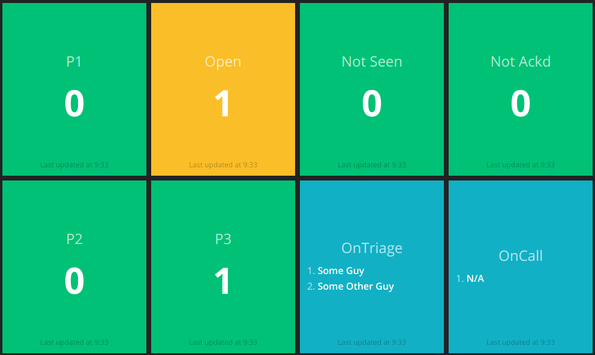

## Overview

An docker [OpsGenie](https://opsgenie.com) dashboard using [Smashing](https://smashing.github.io/).

This makes use of the OpsGenie Alerts and Schedules REST endpoints.

## TODO

- Support multiple environments (dev/prod/staging/etc)
- Make schedule support more flexible
- Support mappings for P1/P2/P3 (i.e. some alerts might use Critical/Warning/Info)

## Usage

Create a `.env` file with the following:

```
GEMS=curb

OPSGENIE_APIKEY=<YOUR_OPSGENIE_APIKEY>
OPSGENIE_SCHEDULE_IDENTIFIER_ON_CALL=<OPTIONAL_OPSGENIE_SCHEDULE_IDENTIFIER_ID>
OPSGENIE_SCHEDULE_IDENTIFIER_ON_TRIAGE=<OPTIONAL_OPSGENIE_SCHEDULE_IDENTIFIER_ID>
```

```
docker-compose up
```

Browse to http://localhost:8080

## Screen shots


